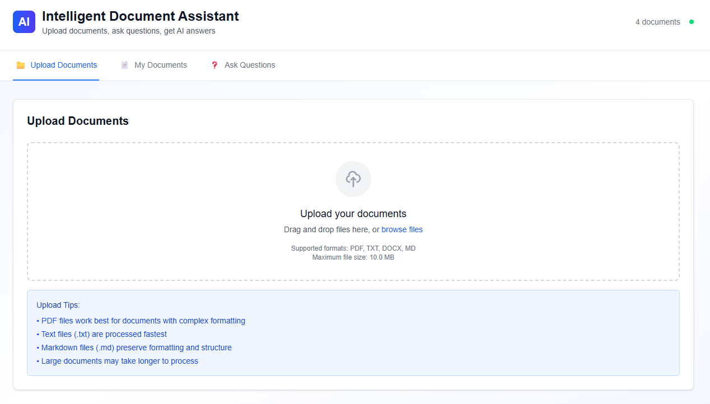

# 🤖 Intelligent Document Assistant



A production-ready AI application built with Next.js 15, TypeScript, and Google Gemini that demonstrates advanced RAG (Retrieval-Augmented Generation) implementation with Supabase vector store and LangSmith observability for document processing and intelligent question answering.

## 🎯 **Project Purpose**

This project is created for **educational and portfolio purposes** to demonstrate:
- Advanced AI engineering skills with LangChain.js and Google Gemini
- Full-stack development with modern technologies (Next.js 15, TypeScript)
- Production-ready application architecture and best practices
- Complete RAG pipeline implementation with Supabase vector store
- LangSmith observability and tracing for AI applications
- Professional software development practices and documentation

## ⚠️ **Important Notice**

**This project is for educational and portfolio use only. Commercial use is prohibited without explicit permission.**

## 🚀 **Key Features**

### **Core Functionality**
- **📄 Document Upload**: Support for PDF, TXT, DOCX, and Markdown files with robust parsing
- **🤖 AI-Powered Q&A**: Ask questions about uploaded documents using Google Gemini 2.0 Flash
- **📚 Source Citations**: Get answers with references to specific document sections
- **🗂️ Document Management**: View, filter, and manage uploaded documents
- **⚡ Real-time Processing**: Live status updates during document processing
- **💬 Chat Interface**: Modern chat UI with typing indicators and message history
- **🔄 Error Recovery**: Comprehensive error handling with retry logic and graceful degradation

### **Technical Excellence**
- **🔒 Type-Safe**: Full TypeScript implementation with strict mode
- **📱 Responsive Design**: Mobile-first approach with Tailwind CSS
- **🛡️ Error Handling**: Comprehensive error handling with retry logic
- **⚡ Performance**: Optimized with proper loading states and caching
- **🔐 Security**: Input validation and file type restrictions

### **AI & RAG Implementation**
- **🧠 Smart Chunking**: LangChain RecursiveCharacterTextSplitter with sentence boundary detection
- **🔍 Vector Search**: Supabase pgvector with HNSW indexing for efficient similarity search
- **🎯 Embedding Generation**: Google Gemini embeddings (3072 dimensions) for semantic understanding
- **📊 Relevance Scoring**: Confidence and relevance metrics for answers
- **🔄 Complete RAG Pipeline**: Query → Embedding → Vector Search → Context Retrieval → AI Generation → Citation
- **📈 Observability**: LangSmith tracing for AI pipeline monitoring and debugging

## 🛠️ **Tech Stack**

### **Frontend**
- **Next.js 15** with App Router
- **TypeScript** (strict mode)
- **Tailwind CSS** for styling
- **React 19** with modern hooks

### **Backend**
- **Next.js API Routes** for backend logic
- **LangChain.js** for AI functionality and RAG pipeline
- **Google Gemini** models (gemini-2.0-flash-exp, gemini-embedding-001)
- **Supabase** with pgvector extension for vector storage
- **Prisma ORM** with Supabase PostgreSQL for metadata
- **Zod** for validation

### **AI & ML**
- **RAG Architecture** with LangChain document chunking
- **Supabase Vector Store** with pgvector for efficient similarity search
- **Google Gemini Embeddings** (3072 dimensions) for semantic understanding
- **LangChain Expression Language (LCEL)** for chain composition
- **Context-Aware Generation** with source citations
- **LangSmith Integration** for observability and tracing

### **Development & Testing**
- **Jest** for unit testing
- **Cypress** for E2E testing
- **ESLint** for code quality
- **TypeScript** for type safety

## 📁 **Project Architecture**

```
document-assistant-ai/
├── app/
│   ├── api/                    # API routes
│   │   ├── health/             # Health check endpoint
│   │   ├── upload/             # File upload endpoint
│   │   ├── process/            # Document processing endpoint
│   │   ├── query/              # Query processing endpoint
│   │   └── documents/          # Document management endpoint
│   ├── client/                 # Client-side components
│   └── layout.tsx              # Root layout
├── components/                 # Reusable UI components
│   ├── FileUpload.tsx          # Drag-and-drop file upload
│   ├── DocumentList.tsx        # Document management interface
│   ├── QueryInterface.tsx     # Question input interface
│   ├── QueryResults.tsx        # AI response display
│   └── ...                     # Other UI components
├── lib/                        # Core business logic
│   ├── types.ts                # TypeScript type definitions
│   ├── utils.ts                # Utility functions
│   ├── ai-services.ts          # AI service integration with LangSmith
│   ├── database.ts             # Database service layer
│   ├── supabase.ts             # Supabase client configuration
│   ├── vector-store.ts         # Supabase vector store integration
│   ├── document-loaders.ts     # LangChain document processing
│   ├── langchain-chains.ts     # RAG chains with LCEL
│   ├── langsmith.ts            # LangSmith observability setup
│   ├── config.ts               # Application configuration
│   └── error-handling.ts       # Error handling utilities
├── prisma/                     # Database schema and migrations
│   └── schema.prisma           # Database models
├── __tests__/                  # Unit tests
├── cypress/                    # E2E tests
└── docs/                       # Documentation
```

## 🚀 **Getting Started**

### **Prerequisites**
- Node.js 18+ 
- npm or yarn
- Google AI API key
- Supabase account (for vector storage)
- LangSmith account (optional, for observability)

### **Installation**

1. **Clone the repository**
   ```bash
   git clone <your-repo-url>
   cd document-assistant-ai
   ```

2. **Install dependencies**
   ```bash
   npm install
   ```

3. **Set up environment variables**
   ```bash
   cp env.example .env.local
   ```
   
   Edit `.env.local` and add your API keys:
   ```env
   GOOGLE_API_KEY=your_google_api_key_here
   DATABASE_URL="file:./dev.db"
   SUPABASE_URL=your_supabase_url
   SUPABASE_ANON_KEY=your_supabase_anon_key
   SUPABASE_SERVICE_ROLE_KEY=your_supabase_service_role_key
   LANGCHAIN_TRACING_V2=true
   LANGCHAIN_API_KEY=your_langsmith_api_key
   LANGCHAIN_PROJECT=document-assistant-ai
   ```

4. **Set up Supabase**
   - Create a new Supabase project at [supabase.com](https://supabase.com)
   - Run the SQL script in `supabase-setup.sql` to create the vector store
   - Copy your project URL and API keys to `.env.local`

5. **Set up LangSmith (Optional)**
   - Create a LangSmith account at [smith.langchain.com](https://smith.langchain.com)
   - Get your API key from the settings
   - Add the API key to `.env.local`

6. **Set up the database**
   ```bash
   npx prisma generate
   npx prisma db push
   ```

7. **Get Google AI API Key**
   - Go to [Google AI Studio](https://makersuite.google.com/app/apikey)
   - Create a new API key
   - Copy the key to your `.env.local` file

8. **Run the development server**
   ```bash
   npm run dev
   ```

9. **Open your browser**
   Navigate to [http://localhost:3000](http://localhost:3000)

## 📖 **Usage**

### **1. Upload Documents**
- Click on the "Upload Documents" tab
- Drag and drop files or click "browse files"
- Supported formats: PDF, TXT, DOCX, MD
- Maximum file size: 10MB

### **2. Manage Documents**
- View uploaded documents in the "My Documents" tab
- Filter by status (uploading, processing, processed, error)
- Select specific documents for targeted queries

### **3. Ask Questions**
- Switch to the "Ask Questions" tab
- Type your question in the text area
- Use example questions or create your own
- Get AI-powered answers with source citations
- View chat history with typing indicators

## 🔧 **API Endpoints**

### **Health Check**
```http
GET /api/health
```
Returns the status of all services (AI, Database, File Storage).

### **File Upload**
```http
POST /api/upload
Content-Type: multipart/form-data

file: [File]
```
Uploads and processes a document file with real text extraction.

### **Document Processing**
```http
POST /api/process
Content-Type: application/json

{
  "documentId": "string",
  "forceReprocess": boolean
}
```
Processes a document and creates searchable chunks with embeddings.

### **Query Processing**
```http
POST /api/query
Content-Type: application/json

{
  "question": "string",
  "documentIds": ["string"],
  "maxResults": number,
  "includeSources": boolean
}
```
Processes a user query and returns AI-generated answers with sources.

### **Document Management**
```http
GET /api/documents
```
Retrieves all uploaded documents with their processing status.

## 🧪 **Testing**

### **Unit Tests**
```bash
npm run test
```

### **Tests with Coverage**
```bash
npm run test:coverage
```

### **E2E Tests**
```bash
npm run test:e2e
```

### **All Tests**
```bash
npm run test:all
```

## 🚀 **Deployment**

### **Vercel (Recommended)**
1. Push your code to GitHub
2. Connect your repository to Vercel
3. Add environment variables in Vercel dashboard:
   - `GOOGLE_API_KEY`: Your Google AI API key
   - `DATABASE_URL`: Your database connection string
4. Deploy!

### **Manual Deployment**
```bash
npm run build
npm start
```

## 🔒 **Environment Variables**

| Variable | Description | Required | Example |
|----------|-------------|----------|---------|
| `GOOGLE_API_KEY` | Google AI API key | Yes | `AIzaSy...` |
| `DATABASE_URL` | Database connection string | Yes | `file:./dev.db` |
| `SUPABASE_URL` | Supabase project URL | Yes | `https://xxx.supabase.co` |
| `SUPABASE_ANON_KEY` | Supabase anonymous key | Yes | `eyJhbGciOiJIUzI1NiIsInR5cCI6IkpXVCJ9...` |
| `SUPABASE_SERVICE_ROLE_KEY` | Supabase service role key | Yes | `eyJhbGciOiJIUzI1NiIsInR5cCI6IkpXVCJ9...` |
| `LANGCHAIN_TRACING_V2` | Enable LangSmith tracing | No | `true` |
| `LANGCHAIN_API_KEY` | LangSmith API key | No | `ls__xxx` |
| `LANGCHAIN_PROJECT` | LangSmith project name | No | `document-assistant-ai` |

## 🏗️ **Architecture Deep Dive**

### **RAG Pipeline Implementation**

1. **Document Upload & Processing**
   ```
   File Upload → Text Extraction (pdf2json/mammoth) → LangChain Chunking → Gemini Embeddings → Supabase Vector Store
   ```

2. **Query Processing**
   ```
   User Query → Query Embedding → Supabase Vector Search → Context Retrieval → Gemini Generation → Response with Citations
   ```

3. **Vector Similarity Search**
   - Supabase pgvector with HNSW indexing for efficient similarity search
   - Google Gemini embeddings (3072 dimensions) for semantic understanding
   - Relevance scoring and ranking with confidence metrics
   - Context window management for optimal response generation

### **Database Schema**
- **Supabase PostgreSQL**: Documents, DocumentChunks, Queries, QuerySources for metadata
- **Supabase Vector Store**: Document embeddings and vector similarity search
- **Unified Architecture**: All data in Supabase for optimal performance and scalability

### **Error Handling & Resilience**
- Exponential backoff retry logic
- Comprehensive error boundaries with React ErrorBoundary
- Graceful degradation with fallback UI
- User-friendly error messages
- Global error handlers to prevent page reloads
- Robust PDF parsing with pdf2json fallback

## 📊 **Performance Features**

### **Optimization Strategies**
- **Lazy Loading**: Components loaded on demand
- **Caching**: API responses cached where appropriate
- **Chunking**: Large documents processed in chunks with LangChain
- **Debouncing**: Search inputs debounced to reduce API calls
- **Vector Search**: Efficient similarity calculations with Supabase pgvector
- **Progress Indicators**: Real-time feedback for long-running operations

### **Monitoring & Observability**
- **Health Checks**: Regular service health monitoring
- **Error Tracking**: Comprehensive error logging
- **Performance Metrics**: Response time tracking
- **Processing Status**: Real-time status updates
- **LangSmith Tracing**: AI pipeline observability and debugging
- **Vector Store Monitoring**: Supabase performance metrics

## 🔧 **Customization**

### **Adding New File Types**
1. Update `DocumentType` in `lib/types.ts`
2. Add extraction logic in `app/api/upload/route.ts`
3. Update validation in `components/FileUpload.tsx`

### **Modifying AI Behavior**
1. Adjust parameters in `lib/ai-services.ts`
2. Update prompts in `lib/langchain-chains.ts`
3. Modify chunking strategy in `lib/document-loaders.ts`
4. Configure LangSmith tracing in `lib/langsmith.ts`

### **Styling Changes**
1. Update Tailwind classes in components
2. Modify color scheme in `tailwind.config.js`
3. Add custom CSS for specific components

## 🎯 **Key Technical Achievements**

### **AI Engineering**
- ✅ Complete RAG pipeline implementation with LangChain
- ✅ Supabase vector store with pgvector for efficient similarity search
- ✅ Google Gemini embeddings (3072 dimensions) for semantic understanding
- ✅ LangChain Expression Language (LCEL) for chain composition
- ✅ Context-aware AI responses with source citations
- ✅ LangSmith observability and tracing integration

### **Full-Stack Development**
- ✅ Type-safe API development with TypeScript
- ✅ Modern React patterns with hooks and context
- ✅ Unified Supabase architecture (PostgreSQL + Vector Store)
- ✅ File processing with robust PDF parsing (pdf2json)
- ✅ Error handling with React ErrorBoundary
- ✅ Real-time UI updates and progress indicators

### **Production Readiness**
- ✅ Comprehensive testing suite (Jest + Cypress)
- ✅ Error handling and retry logic
- ✅ Performance optimization with vector indexing
- ✅ Security considerations and input validation
- ✅ Professional documentation and setup guides
- ✅ LangSmith observability for production monitoring

## 📈 **Performance Metrics**

- **Document Processing**: 5-15 seconds depending on file size
- **Query Response**: 2-5 seconds with Supabase vector search
- **Vector Search**: Sub-second similarity calculations with pgvector
- **UI Responsiveness**: <100ms for user interactions
- **LangSmith Tracing**: Real-time observability with minimal overhead

## 🔮 **Future Enhancements**

- **Multi-language Support**: Process documents in different languages
- **Advanced Chunking**: Semantic chunking based on content structure
- **User Authentication**: Multi-user support with document privacy
- **API Rate Limiting**: Production-grade rate limiting
- **Caching Layer**: Redis integration for improved performance
- **Advanced Analytics**: Document usage analytics and insights
- **Custom Embeddings**: Fine-tuned embeddings for specific domains

## 🤝 **Contributing**

This project is currently **not accepting contributions**. See [CONTRIBUTING.md](CONTRIBUTING.md) for more information.

## 📄 **License**

This project is licensed under the MIT License with commercial use restrictions. See [LICENSE](LICENSE) file for details.

## 📞 **Contact**

For questions about this project or professional opportunities, please reach out through GitHub Issues or LinkedIn.

---

**Built with ❤️ for AI Engineer Portfolio**

**⚠️ Commercial Use Prohibited** - This project is for educational and portfolio purposes only.